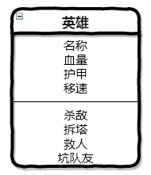

# java 基础
- [README](../README.md)


# 类的方法
## 步骤1 什么是方法
1. 比如队友残血正在逃跑，你过去把路给别人挡住了，导致他被杀掉。 这就是坑队友
2. 每个英雄。。。。都可以坑
3. 所以为Hero这个类，设计一个方法: keng  
  
4. 举个栗子：  
    ```java
    public class Hore {
      String name; //名称

      float healthPoints; //生命值
      
      float armor; //护甲

      int moveSpeed; //移速

      void keng () { //坑队友
        System.out.println("坑队友！");
      }

    }
    ```

## 步骤2 方法返回类型
1. 有的方法是有返回类型的
2. 比如方法：  
    ```java
    float getArmor(){
      return armor;
    }
    ```
3. 这个方法是用来获取一个英雄有多少护甲的，返回类型是float
4. 有的方法不需要返回值，这个时候就把**返回类型设置为void**,表示该方法不返回任何值
5. 比如方法 "坑队友"  
    ```java
    void keng(){
      System.out.println("坑队友！");
    }
    ```  
    ```java
    public class Hero {
      String name; //姓名
        
      float healthPoints; //生命值
        
      float armor; //护甲
        
      int moveSpeed; //移动速度
  
      //获取护甲值
      float getArmor(){
        return armor;
      }
  
      //坑队友
      void keng(){
        System.out.println("坑队友！");
      }
    }
    ```

## 步骤3 方法的参数
1. 英雄在一些特定情况下，可以增加移动速度
2. 这样我们就通过addSpeed这个方法增加移动速度  
    ```java
    void addSpeed(int needAddSpeed){
      //在原来的基础上增加移动速度
      moveSpeed = moveSpeed + needAddSpeed;
    }
    ```
3. int speed 叫做方法的参数
4. 给盖伦增加100的移动速度：  
    ```java
    Hero garen = new Hero()
    garen.game = "盖伦";
    garen.moveSpeed = 350;
    garen.addSpeed(100);
    ```  
    ```java
    public class Hero {
      String name; //姓名
      float healthPoints; //生命值
      float armor; //护甲
      int speedMove; //移速

      //坑队友
      void keng(){
        System.out.println("坑队友！");
      }

      //获取护甲值
      float getArmor(){
        return armor;
      }

      //增加移动速度
      void addSpeed(int needAddSpeed){
        //在原来的基础上增加移动速度
        moveSpeed = moveSpeed + needAddSpeed;
      }

      public static void main(String[] args){
        Hero garen = new Hero();
        garen.name = "盖伦";
        garen.moveSpeed = 350;
        garen.addSpeed(100);
      }
    }
    ```

## 步骤4 方法的命名
1. 方法是一个类的动作行为，所以一般都是以动词开头的，比如 **keng ...**
2. 如果有多个单词，后面的每个单词的第一个字母使用大写 
3. 比如 addSpeed
    ```java
    public class Hero {
      String name; //姓名
        
      float healthPoints; //生命值
        
      float armor; //护甲
        
      int moveSpeed; //移动速度

      //坑队友
      void keng(){
        System.out.println("坑队友！");
      }

      //获取护甲值
      float getArmor(){
        return armor;
      }
        
      //增加移动速度
      void addSpeed(int needAddSpeed){
        //在原来的基础上增加移动速度
        moveSpeed = moveSpeed + needAddSpeed;
      }
    }
    ```

## 步骤5 练习
1. 为英雄类Hero设计几个新的方法：
  1. 超神 legendary(),无参数，无返回类型
  2. 获取当前的血量 getHp(), 无参数，有float类型的返回值
  3. 回血 recovery(float blood)， 有参数 float类型参数 blood表示本次恢复的血量，无返回类型

```java
public class Hero {
  String name; //姓名
    
  float healthPoints; //生命值
    
  float armor; //护甲
    
  int moveSpeed; //移动速度

  //超神
  void legendary(){
    System.out.println("超神杀戮！！！");
  }

  //获取血量
  float getHealthPoints (){
    return healthPoints;
  }

  //回血
  void recoveryBlood (float needRecoveryBlood){
    healthPoints = healthPoints + needRecoveryBlood;
  }

  public static void main (String[] args) {
    Hero garen = new Hero();
    garen.healthPoints = 500;

    System.out.println("盖伦当前的血量是 " + garen.healthPoints);
    System.out.println("回血100");
    garen.recoveryBlood(100);
    System.out.println("盖伦当前的血量是 " + garen.getHealthPoints());
  }
}

```


